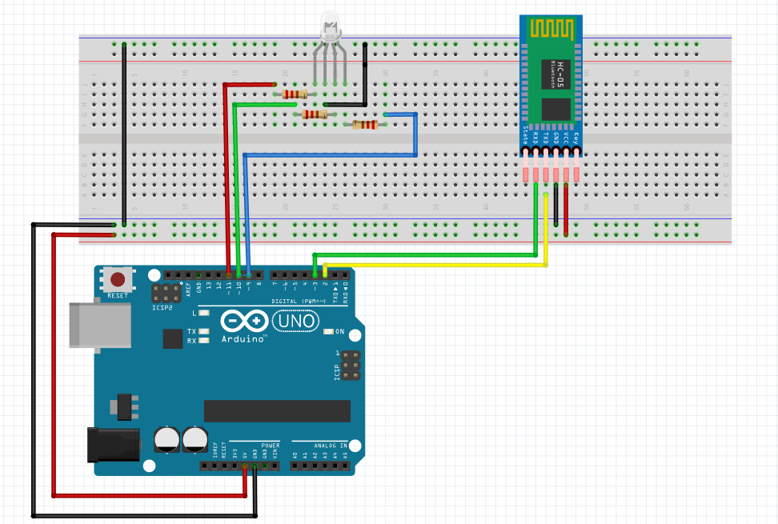
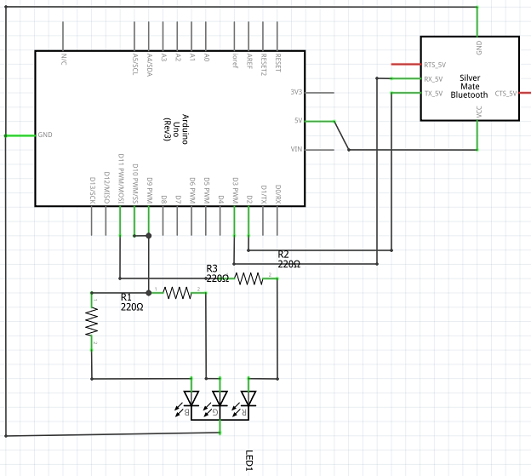

# BluethootRGBSlider
#### Link al repository su [GitHub](https://github.com/leonhardtLudwig/BluethootRGBSlider)

## Leonardo Luigi Pepe & Davide Volpe

### 5IB ITIS C.Zuccante AS 2019/2020

# Descrizione della consegna
- L'obbiettivo del progetto è di produrre un'applicazione **_Android_** in grado di connettersi via Bluethoot ad un **_Arduino_** che utilizza un modulo **Bluethoot _HC-05_**
- In seguito alla connessione dei due dispositivi, l'app Android accede ad una schermata dove è possibile, grazie all'implementazione di 3 slider, inviare all'Arduino un colore
- Sucessivamente questo colore deve essere mostrato grazie ad un Led RGB

# Come è stato affrontato il progetto
- Prima dello sviluppo concreto dell'app c'è stato un lavoro di progettazione e studio sulla definizione degli standard per lo sviluppo dell'applicazione e codice Arduino
- Si è deciso quindi che i dispositivi bluethoot devono comunicare i colori attraverso il formato RGB con la notazione esadecimale
**_Esempio: 00ff00_**.
È stato deciso di utilizzare questa notazione rispetto a quella decimale perché è più facile da prevedere (essendo che per forza la stringa ha 6 caratteri), quindi né l'Arduino e né l'app android necessitano di effettuare vari controlli sulla stringa e quindi procedere immediatamente agli step sucessivi

# Linguaggi, Software e Hardware

## Hardware
- **Arduino UNO** Dispositivo arduino standard in grado di svolgere normalmente qualsiasi tipo di azione senza andare in contro a gravi problemi di memoria

- **HC-05** Modulo bluethoot consegnato dall'insegnante. Attenzione: questo modulo funziona con un baud rate di 38400, quelli che si acquistano su amazon invece funzionano a 9600. Attenzione quindi a modificare il baud rate nel codice arduino nel caso in cui si cambi modulo bluethoot. È un dispositivo bluethoot di classe 2, cioè ha un range di 10 metri in linea d'aria e consuma circa 2.5mW

- **Samsung Galaxy S7 Edge** Principale dispositivo android su cui è stata sviluppata l'applicazione

- **Xiaomi MI8Lite** Dispositivo sui cui sono state effettuate le prove di comunicazione con l'Arduino

### Schema Arduino

### Schema Elettrico

#### Il bluethoot
##### Cenni Storici
 Il Bluetooth è stato sviluppato da Ericsson, un'azienda che, con sede principale a Stoccolma(Svezia) è leader mondiale nella fornitura di tecnologie e servizi per la comunicazione. Il Gruppo è impegnato nella realizzazione della networked society – Società Connessa - attraverso soluzioni efficienti che consentono di lavorare, studiare e vivere in totale libertà in un mondo più sostenibile. Successivamente, il 20 maggio 1999 viene formalizzata e annunicata da SIG(special interest group), associazione formata da Sony Ericsson, IBM, intel, nokia e molte altre.
 Il nome bluetooth è ispirato al re Aroldo I di danimarca(Harold Bluetooth), il quale riusci ad unificare tutte le tribù guerrire in una nazione introducendo il cristianesimo. Infatti la sigla del logo deriva dalle lettere runiche dellse sue iniziali.
##### Come funziona
Bluetooth fornisce un metodo standard, economico e sicuro  per scambiare informazioni tra i dispositivi diversi attraverso una frequenza radio sicura a corto di raggio. Bluetooth cerca i dispostivi coperti dal segnale radio entro un raggio di qualche decina di metri. Questi dispositivi connessi tra loro devono possedere le specifiche hardware e software rihieste dallo standard stesso. Questo standard è stato progettato con l'obiettivo primario di ottenere bassi consumi, un corto raggio d'azione e un basso costo di produzione per i dispositivi compatibili. Esistono 4 diverse classi:
- 1=arriva ad una distanza di 100 metri con una potenza di 100mW
- 2=arriva ad una distanza di 10 metri con una potenza di 2,5 mW
- 3=arriva ad una distanza di 1 metro con una potenza di 1 mW
- 4=arriva ad una distanza di 0,5 metro con una potenza di 0,5 mW

Quando 2 dispositivi bluetooth vengono collegati vien usato un processo chiamato **pairing**, il quale permette il reciproco riconoscimento dei dispositivi.
Il pairing può avvenire anche per contatto fisico(NFC), metodo usato anche per il pagamento nei negozi semplicemente passando il telefono o anche solo la carta di credito con questa funzione.
La comunicazione tra i dispositivi aviene attraverso la commutazione di pacchetto con l'architettura MASTER/SLAVE costituito da intervalli di 12 ms nella qual un dispositivo rimane in contatto mentre l'altro comunica, nell'intervallo successivo avvien il contrario.

## Software e Linguaggi

Per la programmazione dell'Arduino è stato utilizzato l'[IDE gratuito](https://www.arduino.cc/en/main/software) distribuito dall'azienda ufficiale

>L'ambiente di sviluppo integrato di Arduino è fornito di una libreria software C/C++, chiamata "Wiring" (dall'omonimo progetto Wiring): la disponibilità della libreria rende molto più semplice implementare via software le comuni operazioni di input/output. I programmi di Arduino sono scritti in linguaggio derivato dal C/C++, ma all'utilizzatore, per poter creare un file eseguibile, si richiede solo di definire due funzioni: `void setup()` e `void loop()`
[fonte](https://it.wikipedia.org/wiki/Arduino_(software)

Per la programmazione dell'app Android è stato utilizzato l'[IDE gratuito](https://developer.android.com/studio) distribuito da Google in collaborazione con JetBrains
>Android Studio è un ambiente di sviluppo integrato (IDE) per lo sviluppo per la piattaforma Android. È stato annunciato il 16 maggio 2013 in occasione della conferenza Google I/O tenuta dal Product Manager Google, Katherine Chou. Android Studio è disponibile gratuitamente sotto licenza Apache 2.0.
[fonte](https://it.wikipedia.org/wiki/Android_Studio)

### C/C++/Arduino (**BTRicevi**)
#### Librerie utilizzate
- **SoftwareSerial** Libreria necessaria per la comunicazione bluethoot
- **String** Libreria per la gestione delle stringhe

#### Variabili d'ambiente (**Bluethoot1**)
- **RXPin** Pin arduino per la ricezione che va collegato al **TXPin** del modulo HC-05
- **TXPin** arduino per la trasmissione che va collegato al **RXPin** del modulo HC-05
- **REDPin** , **GREENPin** e **BLUEPin** corrispondono ai pin del led rgb per l'invio di un valore da 0 a 255 corrispondente ad un colore
- **myBt** Oggetto per la gestione della comunicazione bluethoot
- **msgChar** Stringa che contiene il messaggio ricevuto
- **hexString** String che contiene mano a mano il valore esadecimale, corrispondente ad un colre, da convertire in decimale
- **r** , **g** e **b** sono variabili intere che contengono il valore da 0 a 255 del colore corrispondente
- **i** è un indice che viene utilizzato all'interno del loop per scorrere le stringhe

#### Funzioni implementate
- **printRGB** Esegue un analog write sui pin del led RGB
- **extractRGB** Estrae dalla stringa ricevuta via bluethoot i valori interi da 0 a 255 di rosso, verde e blu partendo da una stringa esadecimale
- **onlyTwo** Funzione di supporto implementata solo per rendere più leggibile il codice. Copia all'interno di **hexString** due caratteri a partire da un indice passato come parametro

#### Setup
- Nelle stringhe dichiarate in precedenza viene fissato come ultimo carattere **'\n'** per impostare la fine di una stringa
- Viene settato l'input per il pin di ricezione (**RXPin**) e l'output per i pin restanti (**TXPin** , **REDPin** , **GREENPin** e **BLUEPin**)
- Viene inizializzato il modulo bluethoot a 38400 di baudrate
- Viene inizializzata la comunicazione seriale a 9600 di baudrate

#### Loop
- Quando viene effettuato il pairing via bluethoot viene copiato il messaggio all'interno della variabile **msgChar**
- Indipendentemente che l'arduino abbia ricevuto qualcosa o meno vegono richiamate **extractRGB** e **printRGB**

### Android/Java
In andorid per utilizzare le API buetooth sono necessarie le seguenti autorizzazioni che vanno inserite nel file AndroidManifest.xml:
- android.permission.BLUETOOTH
- android.permission.BLUETOOTH_ADMIN
invece per eseguire operazioni di scansione alla ricerca ad sempio di nuovi dispositivi bluetooth va inserita l'istruzione
**android.permission.ACCESS_COARSE_LOCATION** se l'app andrà installata su dispositivi android 9 o inferiori, invece va inserita
**android.permission.FINE_LOCATION** per app con versione superiore ad android 9.

l'oggetto che consente di interfacciarsi con il modulo bluetooth del telefono è denominato BluetoothAdapter.
nel codice java viene utilizzato il metodo statico getDefaultAdapter() per ottenere un'istanza.
se il telefono non ha un modulo bluetooth, il metodo restituisce NULL.
Nel telefono molto importante è attivare le impostazioni dello sviluppatore per attivare il DEBUG USB, modalità che consente ai dispositivi Andorid di comunicare con i computer per facilitare le attività di sviluppo di app per android.

per verificare che il modulo bluetooth sia abilitato, viene utilizzato il metodo isEnabeled(), nel caso non sia abilitato, possiamo richiederne l'abilitazione tramite una intent.

In per se il programma su android è un'insieme dei 2 precedenti progetti ColorRGB e Intent.
Nel progetto ColorRGB modificando 3 seekbar equivalenti ai colori rosso,verde e blu veniva colorato un cerchio mettendo assieme i valori delle 3 seekbar in esadeciamale utilizzato appunto la notazione RGB.
nel progetto Intent invece avviene una richiesta da parte di un componente di una funzionalità che viene implementata in un altro componente. Viene utilizzato per fare interagire le applicazioni tra di loro, sia quelel programmate che quelle già presenti nel sistema.

Aprendo l'applicazione appare una schermata con tutti i dispostivi associati al telefono.
Questa parte di codice java è stata fornita dal professore.
Successivamente, una volta selezionato il dispositivo desiderato(HC-05) avviene l'intent, quindi si apre un'altra schermata nella quale è presente un cerchio centrale con 3 seekbar corrispondenti ai colori rosso,verde e blu. Modificando le 3 seekbar viene modificato il colore del cerchio mettendo assieme i 3 colori delle seekbar. il risultato viene inviato al dispostivo collegato, nel nostro caso l'arduino, con una notazione esadecimale a 6 cifre per comporre una stringa combatta senza rischio di errore nel prendere le cifre e accostarle in una stringa.

<footer>
  
Documentazione scritta da: Volpe Davide e Leonardo Luigi Pepe

  
Progetto fritzing realizzato da: Leonardo Luigi Pepe e Davide Volpe

</footer>
