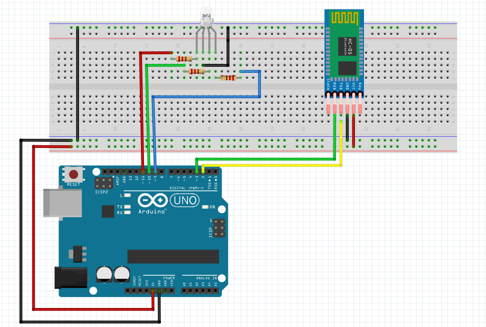
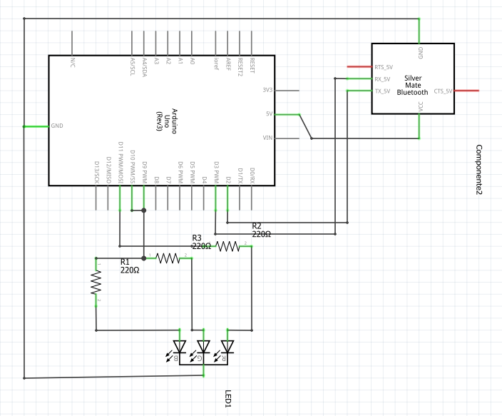

# BluethootRGBSlider

## Leonardo Luigi Pepe & Davide Volpe

### 5IB ITIS C.Zuccante AS 2019/2020

# Descrizione della consegna
- L'obbiettivo del progetto è di produrre un'applicazione **_Android_** in grado di connettersi via Bluethoot ad un **_Arduino_** che utilizza un modulo **Bluethoot _HC-05_**
- In seguito alla connessione dei due dispositivi, l'app Android accede ad una schermata dove è possibile, grazie all'implementazione di 3 slider, inviare all'Arduino un colore
- Sucessivamente questo colore deve essere mostrato grazie ad un Led RGB

# Come è stato affrontato il progetto
- Prima dello sviluppo concreto dell'app c'è stato un lavoro di progettazione e studio sulla definizione degli standard per lo sviluppo dell'applicazione e codice Arduino
- Si è deciso quindi che i dispositivi bluethoot devono comunicare i colori attraverso il formato RGB con la notazione esadecimale
**_Esempio: 00ff00_**.
È stato deciso di utilizzare questa notazione rispetto a quella decimale perché è più facile da prevedere (essendo che per forza la stringa ha 6 caratteri), quindi né l'Arduino e né l'app android necessitano di effettuare vari controlli sulla stringa e quindi procedere immediatamente agli step sucessivi

# Linguaggi, Software e Hardware

## Hardware
- **Arduino UNO** Dispositivo arduino standard in grado di svolgere normalmente qualsiasi tipo di azione senza andare in contro a gravi problemi di memoria

- **HC-05** Modulo bluethoot consegnato dall'insegnante. Attenzione: questo modulo funziona con un baud rate di 38400, quelli che si acquistano su amazon invece funzionano a 9600. Attenzione quindi a modificare il baud rate nel codice arduino nel caso in cui si cambi modulo bluethoot. È un dispositivo bluethoot di classe 2, cioè ha un range di 10 metri in linea d'aria e consuma circa 2.5mW

- **Samsung Galaxy S7 Edge** Principale dispositivo android su cui è stata sviluppata l'applicazione

- **Xiaomi MI8Lite** Dispositivo sui cui sono state effettuate le prove di comunicazione con l'Arduino

### Schema Arduino

### Schema Elettrico

#### Descrizione tecnologia bluethoot
#### Come funziona il ricevitore

## Software e Linguaggi

Per la programmazione dell'Arduino è stato utilizzato l'[IDE gratuito](https://www.arduino.cc/en/main/software) distribuito dall'azienda ufficiale

>L'ambiente di sviluppo integrato di Arduino è fornito di una libreria software C/C++, chiamata "Wiring" (dall'omonimo progetto Wiring): la disponibilità della libreria rende molto più semplice implementare via software le comuni operazioni di input/output. I programmi di Arduino sono scritti in linguaggio derivato dal C/C++, ma all'utilizzatore, per poter creare un file eseguibile, si richiede solo di definire due funzioni: `void setup()` e `void loop()`
[fonte](https://it.wikipedia.org/wiki/Arduino_(software)

Per la programmazione dell'app Android è stato utilizzato l'[IDE gratuito](https://developer.android.com/studio) distribuito da Google in collaborazione con JetBrains
>Android Studio è un ambiente di sviluppo integrato (IDE) per lo sviluppo per la piattaforma Android. È stato annunciato il 16 maggio 2013 in occasione della conferenza Google I/O tenuta dal Product Manager Google, Katherine Chou. Android Studio è disponibile gratuitamente sotto licenza Apache 2.0.
[fonte](https://it.wikipedia.org/wiki/Android_Studio)

### C/C++/Arduino
#### Librerie utilizzate
- **SoftwareSerial** Libreria necessaria per la comunicazione bluethoot
- **String** Libreria per la gestione delle stringhe

#### Variabili d'ambiente
- **RXPin** Pin arduino per la ricezione che va collegato al **TXPin** del modulo HC-05
- **TXPin** arduino per la trasmissione che va collegato al **RXPin** del modulo HC-05
- **REDPin** , **GREENPin** e **BLUEPin** corrispondono ai pin del led rgb per l'invio di un valore da 0 a 255 corrispondente ad un colore
- **myBt** Oggetto per la gestione della comunicazione bluethoot
- **msgChar** Stringa che contiene il messaggio ricevuto
- **hexString** String che contiene mano a mano il valore esadecimale, corrispondente ad un colre, da convertire in decimale
- **r** , **g** e **b** sono variabili intere che contengono il valore da 0 a 255 del colore corrispondente
- **i** è un indice che viene utilizzato all'interno del loop per scorrere le stringhe

#### Funzioni implementate
- **printRGB** Esegue un analog write sui pin del led RGB
- **extractRGB** Estrae dalla stringa ricevuta via bluethoot i valori interi da 0 a 255 di rosso, verde e blu partendo da una stringa esadecimale
- **onlyTwo** Funzione di supporto implementata solo per rendere più leggibile il codice. Copia all'interno di **hexString** due caratteri a partire da un indice passato come parametro

#### Setup
- Nelle stringhe dichiarate in precedenza viene fissato come ultimo carattere **'\n'** per impostare la fine di una stringa
- Viene settato l'input per il pin di ricezione (**RXPin**) e l'output per i pin restanti (**TXPin** , **REDPin** , **GREENPin** e **BLUEPin**)
- Viene inizializzato il modulo bluethoot a 38400 di baudrate
- Viene inizializzata la comunicazione seriale a 9600 di baudrate

#### Loop
- Quando viene effettuato il pairing via bluethoot viene copiato il messaggio all'interno della variabile **msgChar**
- Indipendentemente che l'arduino abbia ricevuto qualcosa o meno vegono richiamate **extractRGB** e **printRGB**

### Android/Java
- lorem ipsum

<footer>
  
Documentazione scritta da: Volpe Davide e Leonardo Luigi Pepe

  
Progetto fritzing realizzato da: Leonardo Luigi Pepe e Davide Volpe

</footer>
